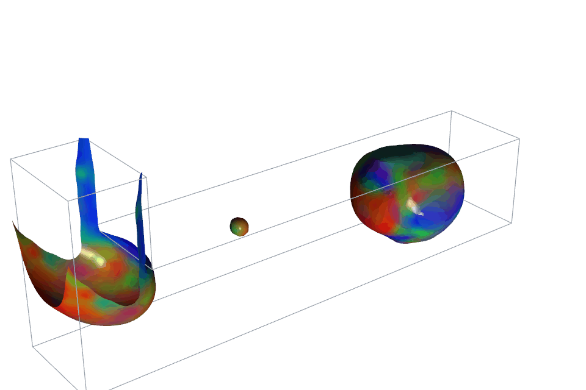
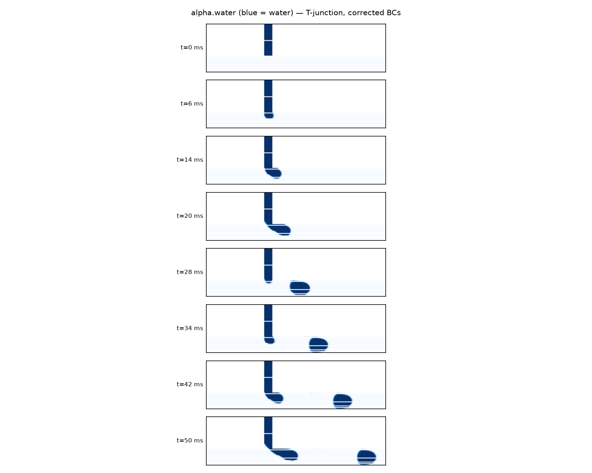

# Microfluidic Causal Chamber (MCC)

A **fluid-dynamics causal chamber**: a microfluidic T-junction droplet generator
with a known, physics-based causal structure, built as a real-world testbed for
causal-inference and AI methodology.

<p align="center">
  
  <br>
  <em>Encoded-droplet twin (<a href="simulation/openfoam/tjunction_3d_encoder/">tjunction_3d_encoder</a>): three dye streams merge and are chopped into droplets whose composition is a symbol. The 3D interface is coloured by composition (R/G/B = the three dyes). 2D verification and the 3D corner-bias result are written up in <a href="simulation/openfoam/results/encoder_dye_2026-08/">results/encoder_dye_2026-08</a>.</em>
</p>

This project extends the [**Causal Chambers**](https://github.com/juangamella/causal-chamber)
of Gamella, Peters & Bühlmann ([Nature Machine Intelligence, 2025](https://www.nature.com/articles/s42256-024-00964-x))
— the light and wind tunnels — into a new domain: two-phase flow and droplet
formation. Pressures drive flow rates drive droplet metrics, a causal graph with
ground truth we can write down from first principles:

```
P_cont → Q_cont ┐
                ├─► Junction ─► f_droplet, d_droplet, L_droplet, code c_i
P_disp → Q_disp ┘
```

> **Relationship to the main project.** This is a standalone repository focused
> solely on the microfluidic chamber. It began as a fork of the upstream
> [`causal-chamber`](https://github.com/juangamella/causal-chamber) dataset
> repo; the wind/light-tunnel datasets, hardware, and datasheets have been
> removed and now live only upstream. See [Credits & upstream](#credits--upstream).

---

## What's here

The code to reproduce the case studies in the original paper can be found in the separate [paper repository](https://github.com/juangamella/causal-chamber-paper).

### Simulation

The [OpenFOAM twin](simulation/openfoam/) is the most developed piece. It models
oil–water droplet generation at a T-junction (`interFoam` / `multiphaseInterFoam`,
Volume-of-Fluid with surface tension) and includes parametric sweeps, mesh
convergence, milled-chip geometries, and the **encoder** study — testing whether
a T-junction faithfully writes dye "codes" (`c_i = Q_i / ΣQ`) into droplets.
Verified results and write-ups live under [`simulation/openfoam/results/`](simulation/openfoam/results/).
Long 3D runs are chunked overnight via the harness in
[`simulation/openfoam/nightly/`](simulation/openfoam/nightly/README.md).

<p align="center">
  <br>
  <sub><em>One full drip cycle in 2D (t&nbsp;=&nbsp;0–50&nbsp;ms): the dispersed phase grows at the junction, necks, pinches off, and advects downstream — the periodic droplet formation the causal graph is built on.</em></sub>
</p>

### Hardware

[`hardware/microfluidic/`](hardware/microfluidic/) holds the chip design plan,
bill of materials, and milling layouts (`mill_chip_v1/v2.svg`). The physical
bench: a milled/laser-cut PMMA chip with 600–800 µm channels (milling-robust;
see [`results/scaleup_2026-07`](simulation/openfoam/results/scaleup_2026-07/)),
electronic pressure controllers as actuators, and a high-speed camera plus
pressure sensors as the observation stack.

---

## Quick start (simulation)

Requires OpenFOAM v2306+ (native Linux, or the ESI Docker image on macOS/arm64 —
see [`simulation/openfoam/README.md`](simulation/openfoam/README.md) and
[`WINDOWS_SETUP.md`](simulation/openfoam/WINDOWS_SETUP.md)).

```bash
cd simulation/openfoam/tjunction_2d
./Allrun          # mesh, initialise, solve
```

---

## Licensing

This repository carries two licenses, matching the split in the upstream project:

- **Code** (`simulation/`, scripts, generators) — [MIT](LICENSE).
- **Datasets, hardware docs, and design material** — [CC BY 4.0](LICENSE-DATA-CC-BY-4.0.txt),
  the same license as the upstream Causal Chambers datasets.

---

## Credits & upstream

This project builds directly on the **Causal Chambers** by Juan L. Gamella,
Jonas Peters, and Peter Bühlmann.

- Main repository: https://github.com/juangamella/causal-chamber
- Python package (`causalchamber`): https://github.com/juangamella/causal-chamber-package
- Paper repository: https://github.com/juangamella/causal-chamber-paper
- Project site: https://causalchamber.org

If you use this work, please cite the original paper:

```bibtex
@article{gamella2025chamber,
  author  = {Gamella, Juan L. and Peters, Jonas and B{\"u}hlmann, Peter},
  title   = {Causal chambers as a real-world physical testbed for {AI} methodology},
  journal = {Nature Machine Intelligence},
  doi     = {10.1038/s42256-024-00964-x},
  year    = {2025}
}
```

The microfluidic extension — design, simulation, and analysis in this repository
— is developed by Alexander Bissell and contributors.
