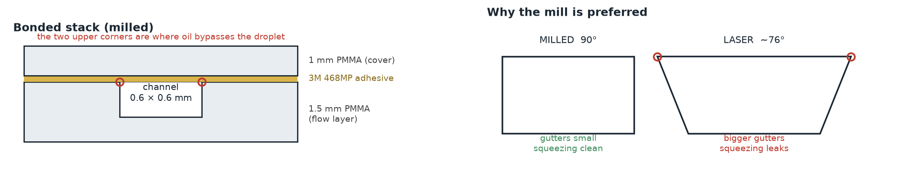

# Microfluidic Causal Chamber



This directory contains the design, simulation, and implementation plan for the **microfluidic causal chamber** - a T-junction droplet generator with known causal structure for testing AI methodologies.

---

## 📋 Documentation Overview

| Document | Purpose | When to Read |
|----------|---------|--------------|
| **[microfluidic_chamber_plan.md](microfluidic_chamber_plan.md)** | Comprehensive technical plan | **Start here** - Detailed design |
| **[../../simulation/openfoam/](../../simulation/openfoam/)** | OpenFOAM simulation (built, verified, results) | Simulation — open-source, no license needed |
| **[chip_bom.md](chip_bom.md)** | Bill of materials with costs | Order components |
| **[REFERENCES.md](REFERENCES.md)** | Bibliography & further reading | As needed - Citations |

Chip layouts (`mill_chip_v1.svg`, `mill_chip_v2.svg`) are generated by
[`gen_chip_layout.py`](gen_chip_layout.py); the OpenFOAM digital twin lives in
[`../../simulation/openfoam/`](../../simulation/openfoam/).

---

## 🚀 Quick Start

**New to the project?** Read in this order:

1. **[microfluidic_chamber_plan.md](microfluidic_chamber_plan.md)** - Understand the design and vision
2. **[chip_bom.md](chip_bom.md)** - Check budget and components

**Ready to simulate?**  
→ **[simulation/openfoam/](../../simulation/openfoam/)** - Open-source, no license needed.
Start with [`tjunction_2d`](../../simulation/openfoam/tjunction_2d/), or see the verified
[scale-up](../../simulation/openfoam/results/scaleup_2026-07/) and
[encoded-droplet](../../simulation/openfoam/results/encoder_dye_2026-08/) results.
*(There used to be a COMSOL guide here — it was never actually built; see
`microfluidic_chamber_plan.md` §4.)*

---

## 🎯 Project Goals

1. **Extend Causal Chambers** to fluid dynamics domain
2. **Build working T-junction** droplet generator
3. **Validate causal structure** through experiments
4. **Create open datasets** for AI research
5. **Validate against OpenFOAM** simulations

**Timeline**: ~6 months from start to publication-ready  
**Budget**: $4k-9k (medium-cost options)

---

## 📊 System Overview

### Physical System

```
                    Water + Dye
                         ↓
    Oil + Surfactant → ╪══════> Droplets
                         
    Actuators:           Sensors:
    - P_cont (pressure)  - Pressure sensors (3×)
    - P_disp (pressure)  - High-speed camera (>200 fps)
    - P_out (pressure)
```

### Causal Graph

```
P_cont → Q_cont → Junction → f_droplet, d_droplet, L_droplet
P_disp → Q_disp ────┘

(Pressures cause flow rates via Hagen-Poiseuille,
 flow rates cause droplet metrics via interfacial physics)
```

### Hardware Components

- **Chip**: PMMA, 600–800 μm channels (milling-robust; see [scale-up study](../../simulation/openfoam/results/scaleup_2026-07/) — 400 μm works but needs a fragile 1/64" endmill)
- **Actuation**: Electronic pressure controllers (2×)
- **Observation**: Machine vision camera (>200 fps)
- **Sensing**: Digital pressure sensors (3×)
- **Control**: Python + Arduino/PC

---

## 📁 Related Directories

### Dataset Template

```
../../datasets/mf_tjunction_test_v1/
├── README.md               ← Dataset description
├── variables.csv           ← Variable definitions
├── Makefile                ← Generate protocols
├── generators/
│   └── pressure_flow_calibration.py  ← Example experiment
└── protocols/              ← Generated experiment protocols
```

**Usage:**
```bash
cd ../../datasets/mf_tjunction_test_v1/
make protocols   # Generate all .txt protocol files
```

### Simulation (OpenFOAM twin)

```
../../simulation/openfoam/
├── tjunction_2d/           ← 2D T-junction case (start here)
├── tjunction_3d_encoder/   ← 3-dye "encoder" study
├── scripts/                ← extraction + analysis
└── results/                ← verified runs and write-ups
```

For upstream causal-analysis examples, see the
[causal-chamber-paper](https://github.com/juangamella/causal-chamber-paper) repo.

---

## 🛠️ Development Phases

### ✅ Phase 0: Planning (This Document)
- [x] Literature review
- [x] System design
- [x] Documentation
- [x] BOM creation

### ✅ Phase 1: Simulation
- [x] OpenFOAM model (2D + 3D T-junction, `interFoam` / `multiphaseInterFoam`)
- [x] Parametric sweep ([`results/sweep_2026-07`](../../simulation/openfoam/results/sweep_2026-07/), [`results/scaleup_2026-07`](../../simulation/openfoam/results/scaleup_2026-07/))
- [ ] Order components

### ⏳ Phase 2: Fabrication (Weeks 5-8)
- [ ] Mill chip
- [ ] Assemble fluid handling
- [ ] Integrate sensors/camera

### ⏳ Phase 3: Software (Weeks 9-12)
- [ ] Control software
- [ ] Image processing
- [ ] Protocol interpreter

### ⏳ Phase 4: Characterization (Weeks 13-16)
- [ ] Calibration experiments
- [ ] Validate causal graph
- [ ] Compare bench results to OpenFOAM predictions

### ⏳ Phase 5: Datasets & Publication (Weeks 17-24)
- [ ] Case study experiments
- [ ] Dataset release
- [ ] Manuscript preparation

---

## 💡 Key Features

### Why This is a Good Causal Chamber

1. **Known Ground Truth**: Physics-based causal graph (P → Q → droplets)
2. **Controllable**: Direct actuation of pressures (exogenous variables)
3. **Observable**: Rich sensor data (pressure, video)
4. **Validated**: Compare to 20+ years of microfluidics literature
5. **Accessible**: Medium budget, safe operation, small footprint

### What Makes This Novel

1. **First fluid dynamics causal chamber** (complements optics/aerodynamics)
2. **Intrinsic temporal dynamics** (periodic droplet formation)
3. **Multi-modal data** (time-series + video)
4. **Open, verified OpenFOAM model** for simulation benchmarking — no license needed

---

## 📖 Background Reading

### Essential (Read First)

1. **Gamella et al. (2025)**: Causal Chambers paper (Nature MI)  
   → Defines causal chamber concept

2. **Garstecki et al. (2006)**: T-junction scaling laws (Lab Chip)  
   → Key physics for droplet size prediction

3. **Peters et al. (2017)**: Elements of Causal Inference  
   → Causal discovery methods

### Recommended

- **Christopher & Anna (2007)**: Microfluidic droplet review
- **Bruus (2008)**: Theoretical Microfluidics textbook

**Full bibliography**: [REFERENCES.md](REFERENCES.md)

---

## 🤝 Contributing

This is an **open project** following the Causal Chambers philosophy:

- **Hardware**: CC BY 4.0 (schematics, CAD files)
- **Software**: MIT License (control code, analysis scripts)
- **Datasets**: CC BY 4.0 (CSV files, images)

**Want to help?**
- Build your own version (report back!)
- Improve documentation
- Contribute datasets with different geometries/fluids
- Add analysis notebooks

---

## 🙏 Acknowledgments

This project builds on:
- **Causal Chambers** (Gamella, Peters, Bühlmann)
- **Microfluidics community** (Garstecki, Whitesides, Stone, Anna, and many others)
- **Causal inference community** (Pearl, Peters, Schölkopf, Runge, and colleagues)

---

## 📝 Citation

If you use this design:

```bibtex
@misc{bissell_mcc,
  author={Bissell, Alexander},
  title={Microfluidic Causal Chamber: T-Junction Design},
  howpublished={GitHub Repository},
  url={https://github.com/a-bissell/microfluidic-causal-chamber}
}
```

And please cite the original Causal Chambers paper:

```bibtex
@article{gamella2025chamber,
  author={Gamella, Juan L. and Peters, Jonas and B{\"u}hlmann, Peter},
  title={Causal chambers as a real-world physical testbed for {AI} methodology},
  journal={Nature Machine Intelligence},
  doi={10.1038/s42256-024-00964-x},
  year={2025}
}
```

---

## 🔗 Quick Links

| Resource | Link |
|----------|------|
| **Main Repository** | [Causal Chambers GitHub](https://github.com/juangamella/causal-chamber) |
| **Python Package** | [causalchamber PyPI](https://pypi.org/project/causalchamber/) |
| **Original Paper** | [Nature MI](https://www.nature.com/articles/s42256-024-00964-x) |
| **OpenFOAM Simulation** | [`simulation/openfoam/`](../../simulation/openfoam/) |
| **Microfluidics Resources** | [Elveflow](https://www.elveflow.com/microfluidic-reviews/) |

---

**Ready to start?** Open [microfluidic_chamber_plan.md](microfluidic_chamber_plan.md).

**Questions?** Check [REFERENCES.md](REFERENCES.md).

